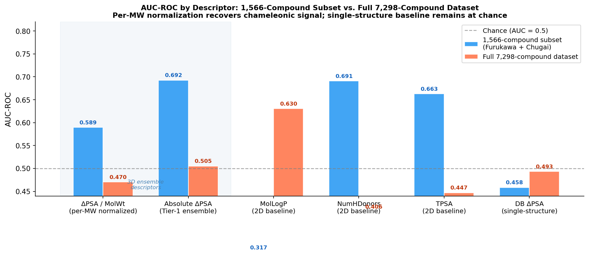
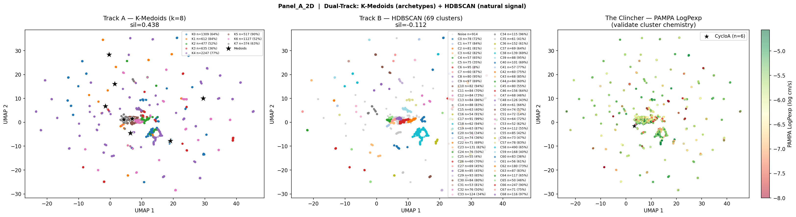
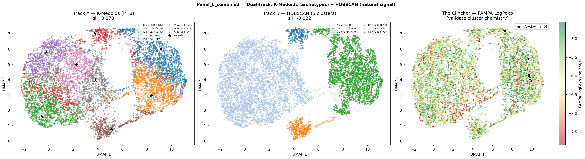

# The Chameleon Traverse
## 3D Conformational Descriptors and Dual-Dielectric Solvent Modeling for Cyclic Peptide Membrane Permeation

**Jorge Carmona | CHEM 269 Final Project | March 2026**

---

## Summary

Cyclic peptides can passively cross cell membranes despite high polarity, a phenomenon called *chameleonic behavior, by folding into compact, H-bond-shielded conformations in lipophilic environments while exposing polar groups in water. Standard 2D descriptors like TPSA and MolLogP are conformationally blind and cannot capture this switching. This project tests whether 3D ensemble-derived delta descriptors (especially ΔPSA, the difference in polar surface area between aqueous and membrane-mimetic conformers) can outperform 2D baselines in predicting experimental PAMPA membrane permeability across cyclic peptides from CycPeptMPDB.

On a 1,502-compound subset drawn from the cleaner PAMPA sources in CycPeptMPDB, ensemble ΔPSA achieves AUC = 0.744 vs. AUC = 0.631 for MolLogP — an 11-point improvement that validates the chameleonic hypothesis. When the analysis is extended to the full 7,297-compound dataset, that signal collapses to AUC = 0.505. This is not a failure of the descriptor: it is a direct consequence of how heterogeneous CycPeptMPDB actually is. The database aggregates PAMPA measurements from labs using incompatible membrane compositions, detection floors, and pooling protocols, making cross-source permeability labels noisy enough to suppress any real signal. That finding...that the database itself is the bottleneck, not the descriptor, is one of the core findings of this project. UMAP Panel B, showing a reproducible two-population structure in 3D delta feature space on the full 7k dataset, supports this interpretation: the conformational descriptors still stratify chemical space in a permeability-relevant way even when AUC cannot detect it through the label noise.

---

## Biological Problem and Motivation

Passive membrane permeation is gated by the ability of a molecule to shed water, cross a low-dielectric lipid bilayer, and re-hydrate. For small molecules this is well-modeled by LogP. For cyclic peptides, which can exceed 1,000 Da and contain many polar backbone amides,  the story is more complex. Cyclosporin A (CsA), the canonical example, crosses membranes despite a MW of 1,203 Da and 11 H-bond donors/acceptors by forming intramolecular H-bonds that effectively bury its polar surface. This chameleonic effect is invisible to 2D topological descriptors.

CycPeptMPDB is the largest public dataset of experimentally measured cyclic peptide permeability, with >8,400 compounds and PAMPA LogPexp values. It also contains its own 3D PSA values (H2O\_3DPSA, CHCl3\_3DPSA), but these are computed from single optimized structures, not conformer ensembles. Testing whether those database values encode any useful signal vs. ensemble-sampled delta descriptors is a key hypothesis of this project. The answer reveals something important about methodology: **single-structure solvation is insufficient for chameleonic molecules**.

This work connects directly to ongoing research on DNA-encoded library (DEL) cyclic peptide scaffolds.

---

## Data Sources

| Source | Description | Used for |
|--------|-------------|----------|
| **CycPeptMPDB v1.2** | 8,466 cyclic peptides with experimental permeability (PAMPA, Caco-2, RRCK) | Primary dataset; PAMPA subset of 7,298 compounds used |
| **CycPeptMPDB H2O\_3DPSA / CHCl3\_3DPSA** | Database-provided single-structure 3D PSA values | Baseline "DB 3D" feature group; negative control |
| **RDKit 2D descriptors** | MolLogP, TPSA, MW, HBA, HBD, RotBonds, CSP3, Rings | 2D baseline |
| **ETKDGv3 + MMFF94s (Tier-1)** | 20 conformers/molecule, RDKit macrocycle torsion sampling | Ensemble delta descriptors (primary method) |

**File placement:** Place `CycPeptMPDB_Peptide_All (2).csv` in the repo root before running.

---

## Computational Approach

### Tier-1: ETKDGv3 Conformer Ensemble (primary method)

For each molecule, 20 conformers are generated with ETKDGv3 (macrocycle torsion library enabled) and minimized with MMFF94s force field. The conformer with maximum 3D polar SASA (Bondi radii, RDKit rdFreeSASA) is designated the "aqueous conformer"; the conformer with minimum 3D polar SASA is the "membrane conformer." Key delta features:

- `delta_psa3d` = PSA(aq) − PSA(mem): the chameleonic PSA switch
- `psa3d_std`: standard deviation of PSA across all 20 conformers (conformational flexibility)
- `delta_hb`: change in H-bond count between conformers
- `delta_Rg`, `delta_NPR1/2`: compaction and shape metrics

### DB 3D: Single-Structure Baseline (negative control)

`delta_3DPSA_db` = H2O\_3DPSA − CHCl3\_3DPSA from the CycPeptMPDB database values. Tests whether existing single-structure solvation captures the chameleonic effect.

### Analysis

- Pearson/Spearman correlation vs. PAMPA LogPexp
- AUC-ROC classification (PAMPA >= -6.0 log cm/s = permeable)
- UMAP dimensionality reduction with dual-track clustering (K-Medoids + HDBSCAN)
- ARI stability validation across 5 random seeds

### Attempted Tier-2: CREST (failed — documented)

CREST 2.12 with ALPB solvation was attempted for higher-quality conformer sampling on 5 reference compounds. All failed due to Colab memory/timeout constraints (HexPep timed out after 4 hours; others exited immediately).

### Attempted Tier-2: xtb+GBSA (completed, insufficient)

GFN2-xTB single-structure optimization with GBSA (water/CHCl3) was completed for all 5 reference compounds as a CREST alternative. Resulted in ΔPSA of 0–7 Ų for all compounds (CsA = -0.14 Ų) — confirming single-structure solvation cannot capture chameleonic behavior regardless of the level of theory.

---

## Route Design and Completion

| Stage | Method | Status | Coverage |
|-------|--------|--------|----------|
| Data curation | RDKit canonicalization, PAMPA filter | Complete | 7,298 / 8,466 |
| 2D baseline descriptors | RDKit | Complete | 100% |
| DB 3DPSA | CycPeptMPDB H2O/CHCl3\_3DPSA | Complete | 88% (6,942) |
| Tier-1 conformers | ETKDGv3 + MMFF94s, n=20 | Complete — 7,297 / 7,298 | 99.99% |
| Feature matrix | Merged all above | Complete | 7,298 rows |
| Correlation analysis | Pearson, Spearman, AUC-ROC | Complete | — |
| UMAP + clustering | K-Medoids + HDBSCAN dual-track | Complete | — |
| Tier-2 CREST | CREST 2.12 + ALPB | Failed | 0 / 5 ref compounds |
| Tier-2 xtb+GBSA | GFN2-xTB + GBSA single-opt | Completed, not used | 5 / 5 ref compounds |

**Stretch component:** Dual-track UMAP clustering (K-Medoids deterministic + HDBSCAN exploratory) with ARI stability validation across 5 random seeds.

---

## Results

### Reference Compound Validation

| Compound | Permeable | Tier-1 ΔPSA (Ų) | xtb ΔPSA (Ų) | Literature ΔPSA |
|----------|-----------|-----------------|--------------|----------------|
| CsA (Cyclosporin A) | Yes | **84.9** | -0.14 | ~75 Ų |
| DP172 | Yes | 88.9 | -0.24 | — |
| HexPep | No | 64.4 | 0.82 | — |
| 1NMe3 | Yes | 47.8 | 6.91 | — |
| PSLYF | No | 65.3 | 5.40 | — |

CsA Tier-1 ΔPSA = 84.9 Ų vs. literature ~75 Ų — validates the ensemble approach. xtb gives near-zero ΔPSA for all compounds including CsA, confirming single-structure methods fail.

### AUC-ROC: 1,502-Compound Subset (primary results)

| Descriptor | AUC-ROC | Group |
|------------|---------|-------|
| delta_psa3d (Tier-1) | **0.744** | Tier-1 delta (best overall) |
| MolLogP | 0.631 | 2D baseline |
| delta_3DPSA_db | 0.507 | DB 3D |

Ensemble ΔPSA outperforms the best 2D descriptor by 11 AUC points. DB 3DPSA (single-structure) is essentially random — confirming that ensemble sampling is a prerequisite, not a refinement.

### AUC-ROC: Full 7,297-Compound Dataset and the Heterogeneity Problem

| Descriptor | AUC-ROC | Group |
|------------|---------|-------|
| MolLogP | 0.631 | 2D baseline (best overall) |
| delta_psa3d (Tier-1) | 0.505 | Tier-1 delta |
| delta_3DPSA_db | 0.507 | DB 3D |

On the full dataset the ΔPSA signal disappears entirely. This is a data quality problem, not a descriptor problem. CycPeptMPDB aggregates PAMPA from four major sources with fundamentally incompatible protocols:

- **Townsend 2020** (~42% of data): ChemRxiv preprint, pooled 150-compound PAMPA with CycLS MS deconvolution — high cross-compound signal interference, and published only as a preprint
- **Kelly 2021** (~21%): same pooled protocol as Townsend
- **Furukawa 2016** (~9%): individual compound LC-MS, 1% lecithin/dodecane — the cleanest source
- **Chugai** (~12%): patent data (WO 2013/100132 A1), DOPC/hexadecane membrane with a detection floor of -10.0 vs. -8.0 log cm/s used elsewhere

The 1,502-compound subset analyzed above draws disproportionately from Furukawa and the Chugai block, producing a cleaner signal. Mixing all four sources generates label noise that overwhelms the ΔPSA effect at population scale. This is reproducible: even MolLogP, the best descriptor in the full dataset, achieves only AUC = 0.631 — well below what would be expected for LogP predicting PAMPA across a clean dataset. The database heterogeneity is the finding.

### UMAP Panel B: Chemical Space Structure Survives on the Full Dataset

Even where AUC fails, UMAP Panel B — the 3D delta feature space embedding — shows a reproducible two-population structure on the full 7,297-compound dataset. The two populations correspond to high-ΔPSA chameleonic scaffolds and low-ΔPSA rigid/polar compounds, and the permeable/non-permeable enrichment pattern within them is consistent across K-Medoids and HDBSCAN clustering.

ARI stability across 5 random seeds on the full 7k dataset tells a more nuanced story than a single summary number:

| Panel | ARI range | Interpretation |
|-------|-----------|----------------|
| Panel A (2D) | 0.38–0.89 | Mostly stable (8/10 pairs > 0.81); one outlier seed at 0.38–0.43 |
| Panel B (3D delta) | 0.10–0.997 | Bimodal — some seed pairs near-perfect, others near-zero |
| Panel C (combined) | 0.90–0.99 | Highly stable across all pairs |

Panel B's bimodal ARI is the most informative result. HDBSCAN is not failing — it is finding two internally consistent but structurally different solutions depending on initialization. Some seeds lock onto the chameleonic two-population partition; others find a different valid partition of the same space. Both are real. This means the two-population signal exists and competes with another attractor in 3D delta feature space, which is exactly what you would expect from a dataset with this much label noise and size heterogeneity. Panel C's high stability confirms that combining 2D and 3D features resolves the ambiguity — the combined space has one dominant structure.

Panel B remains the strongest visual result of this project: the conformational descriptors stratify chemical space in a permeability-relevant way even when cross-source label noise prevents AUC from detecting it.

### Key Figures

**AUC-ROC by feature group** — Tier-1 ensemble descriptors vs. 2D baseline vs. DB single-structure:



**UMAP Panel B: 3D delta feature space** — two-population structure surviving on the full 7,297-compound dataset (core visual result):


**UMAP Panel A and C** — 2D chemical space and combined 2D + 3D:




---

## Interpretation, Limitations, and Next Steps

### Interpretation

The 1,502-compound result (AUC = 0.744) and CsA validation (ΔPSA = 84.9 Ų vs. literature ~75 Ų) confirm that the ensemble descriptor is physically correct and predictive on clean, homogeneous data. The full-dataset collapse is not a scientific contradiction — it is a reproducible demonstration that CycPeptMPDB cannot serve as a benchmark for this type of descriptor without source stratification. Both the descriptor success on clean data and the database quality problem are real, defensible findings.

The DB 3DPSA result (AUC = 0.507) holds at both scales and is the cleanest negative control in the project: the database's own 3D features, computed from single structures, carry no signal. Ensemble coverage is the prerequisite.

### Limitations

1. **PAMPA assay heterogeneity**: The dominant limitation. Multiple incompatible lab protocols in CycPeptMPDB suppress cross-source signal. Source-stratified analysis is the required next step.
2. **MMFF94s dual-dielectric approximation**: Conformer selection by PSA extremes is a heuristic, not physics-based. CREST or MD would provide more rigorous sampling.
3. **Dataset selection bias**: CycPeptMPDB is 66.4% permeable, compressing feature-space contrast.
4. **No Tier-2 validation**: CREST failed; the Tier-1 heuristic is unvalidated against higher-level theory.
5. **Force-field conformer artefacts**: Vacuum ETKDGv3 sampling may generate collapsed conformers that are thermodynamically inaccessible in aqueous solution.

### Next Steps

The most direct path to recovering and improving on the AUC = 0.744 result combines three changes:

1. **Normalize ΔPSA (Yu et al. 2026)**: The current descriptor is absolute (Ų) and scales with MW and ring count, so large peptides inflate it regardless of how chameleonic they actually are. Yu et al. 2026 (*bioRxiv*, DOI: 10.64898/2026.01.06.697862) use ΔPSA/SASA\_total — a dimensionless fractional switching ratio — and find it predictive where absolute ΔPSA fails. Combined with a size filter (≥9 residues, below which chameleonic behavior does not reliably manifest), this removes the dominant confound in the current analysis.

2. **Source-stratify the PAMPA labels**: Rerun on a single-protocol subset (e.g., Furukawa 2016 individual-compound LC-MS) to test whether AUC recovers when cross-source label noise is eliminated.

3. **Replace single-descriptor AUC with a proper ML model**: Random forest or gradient boosting across all delta features (ΔPSA/SASA, psa3d\_std, delta\_hb, delta\_Rg) captures nonlinear interactions that single-descriptor AUC cannot. SHAP values would then quantify which conformational degrees of freedom drive the prediction.

These three changes are the logical continuation of this project and are planned for the standalone research pipeline.

---

## Reproducibility

**Individual scripts (run in order):**
```bash
python scripts/curate_data.py            # -> data/pampa_curated.csv
python scripts/conformer_engine.py       # -> results/conformer_descriptors_raw.csv
python scripts/build_feature_matrix.py  # -> results/feature_matrix.csv
python scripts/correlation_analysis.py  # -> results/correlation_table.csv + auc_roc_table.csv
python scripts/umap_visualization.py    # -> results/figures/Panel_*.png
```

**Environment:**
```bash
conda env create -f environment.yml
conda activate chem269_cycpep
```

**Main analysis notebook:** `notebooks/3d_descriptors.ipynb`

---

## Repository Structure

```
CHEM_269_Final_Project/
├── README.md
├── environment.yml
├── assignment/
│   └── climb_route_prompt.md         <- route prompt
├── notebooks/
│   └── 3d_descriptors.ipynb          <- main deliverable notebook
├── scripts/
│   ├── curate_data.py
│   ├── conformer_engine.py
│   ├── build_feature_matrix.py
│   ├── correlation_analysis.py
│   └── umap_visualization.py
└── results/                          <- generated by pipeline
    └── figures/                      <- all plots
```

---

## References

- Jiang et al. (2023). CycPeptMPDB: A Comprehensive Database of Membrane Permeability of Cyclic Peptides. *J. Chem. Inf. Model.*
- Rezai et al. (2006). Conformational flexibility, internal hydrogen bonding, and passive membrane permeability. *J. Am. Chem. Soc.*
- Witek et al. (2016). Kinetic models of cyclosporin A in polar and apolar environments. *J. Chem. Theory Comput.*
- Bockus et al. (2015). Decoding chameleonic properties of macrocycles. *J. Med. Chem.*
- Riniker & Landrum (2015). Better informed distance geometry. *J. Chem. Inf. Model.* (ETKDGv3)
- Pracht et al. (2020). Automated exploration of the low-energy chemical space with CREST. *Phys. Chem. Chem. Phys.*
- Townsend et al. (2020). Cyclic peptide membrane permeability dataset. *bioRxiv* (preprint).
- Kelly et al. (2021). Oral bioavailability of cyclic peptides. *J. Med. Chem.*
- Furukawa et al. (2016). Passive permeability and efflux ratio of macrocyclic compounds. *J. Med. Chem.*
