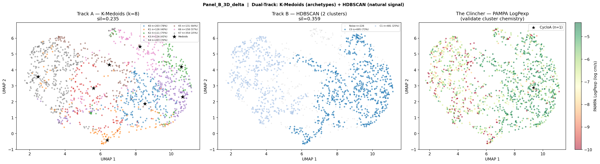
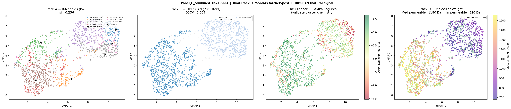

# 3D Descriptor UMAP Analysis of CycPeptMPDB — v2

**Rebuilt to address Juan Hu's inline comments (Jul 11, 2026).** This version fixes the
figure-caption gaps, states the dataset provenance explicitly, and clarifies which panel
uses which subset and what the two populations mean.

---

## Responses to your comments

> **JH (10:31 AM):** *"In the analysis, did you run all 1,500 molecules through the workflow to generate the 2D and 3D descriptors?"*

**Both the 2D and the 3D descriptors were computed once, for all 7,298 PAMPA-bearing
compounds** — not separately for the 1,500. The 1,500-compound set is not a different
descriptor run; it is a *filter* applied to the same feature matrix afterward (the
Furukawa 2016 + Chugai 2013 sources, which use consistent PAMPA protocols). Every subset
in this note is a **view of the same descriptor table**, chosen to match the question
being asked. See *Dataset provenance* below.

> **JH (10:38 AM):** *"Please add figure caption for each figure. Same for other figures in the note."*

Done — every panel now has a caption stating its subset (n), inputs, and what the tracks
show. See *Figures*.

> **JH (10:45 AM):** *"So this one is from 7K molecules? And the first one is for 1502 molecules? And the two populations are <9 and ≥9 cycles?"*

- **7K panels:** Panel A (2D) and the full-dataset Panel B/C are the **6,938-compound** set
  (7,298 with PAMPA, 6,938 with complete features).
- **1,502 panel:** the cleaner Panel B is the **Furukawa + Chugai** subset (~1,502 for AUC;
  1,566 for the combined Panel C — the small difference is feature completeness).
- **The two populations ≈ small vs large (i.e. roughly <9 vs ≥9 residues) — yes.** The MW
  panel (Track D) is direct evidence: the permeable population has median **MW 1,180 Da**
  vs **820 Da** for the impermeable one (1.44×), and residue length spans 6–15. The
  permeable cluster is the large, CsA-class macrolides. We can make this explicit with a
  residue-count-colored panel (see *Proposed next panel*) — that directly answers the
  <9/≥9 question you raised.

---

## Dataset provenance (the funnel)

```
CycPeptMPDB v1.2 ............................. 8,466 cyclic peptides
  − no PAMPA measurement ..................... −1,168
  = with PAMPA LogPexp ....................... 7,298   ← 2D + 3D descriptors computed HERE, once, for all
      − missing/incomplete features .......... −360
      = complete feature matrix (UMAP) ....... 6,938   ← "7K" panels
      ∩ Furukawa 2016 + Chugai 2013 only ..... ~1,502  ← "clean" panels (consistent assay protocol)
```

**Permeability label:** PAMPA LogPexp ≥ −6.0 log cm/s = permeable.
**Why the clean subset exists:** CycPeptMPDB pools PAMPA from labs with incompatible
membrane compositions and detection floors. Furukawa (individual-compound LC-MS) and
Chugai (single membrane formulation) are the internally consistent sources; mixing in the
pooled Townsend/Kelly protocols injects cross-source label noise (see *The heterogeneity
finding*).

## What features we extracted

All three feature groups were computed for every compound; the UMAP panels differ only in
which group is fed to the embedding.

| Group | Features | Source |
|-------|----------|--------|
| **2D baseline** | MolLogP, TPSA, MolWt, NumHDonors, NumHAcceptors, NumRotatableBonds, RingCount | RDKit (topological — conformation-blind) |
| **3D Tier-1 Δ** | delta_psa3d, psa3d_std, delta_hb, delta_Rg, delta_NPR1, delta_NPR2, delta_Asphericity | ETKDGv3 + MMFF94s ensemble (20 conf/mol); Δ = aqueous-conformer − membrane-conformer |
| **DB 3D** (control) | H2O_3DPSA, CHCl3_3DPSA, delta_3DPSA_db | CycPeptMPDB single-structure values |

The **3D Δ descriptors** are the chameleonic signal: the difference in a geometric property
between the most-polar-exposed (aqueous) and most-buried (membrane) conformer of the
ensemble. `delta_psa3d` = PSA(aq) − PSA(mem) is the headline switch.


**Figure 0. Every extracted feature vs. its single-feature AUC-ROC for PAMPA permeability
(threshold −6.0 log cm/s), colored by group: 2D baseline (green), DB single-structure 3D
(purple), Tier-1 Δ conformer-ensemble (orange).** This is the full feature inventory. On the
full dataset shown here no single feature separates well (all near 0.5–0.63); the Tier-1 Δ
features only pull ahead on the clean-source subset (see *The heterogeneity finding*).

> ## ⚠️ Important caveat: the Tier-1 ΔPSA here is exploratory, not physically weighted
>
> **How it was computed.** For each molecule we generated a vacuum ETKDGv3 + MMFF94s
> ensemble and took the **single highest-PSA conformer** and the **single lowest-PSA
> conformer**. `delta_psa3d` is the gap between those two extremes. It is deliberately a
> **first-pass, exploratory** descriptor — the goal was to see the *accessible PSA range* of
> a molecule, not to model its real behavior.
>
> **The assumption behind it.** In vacuum, sampling tends to stretch a molecule through all
> its physically possible geometries. Under that assumption the **highest-PSA** extreme is a
> stand-in for a solvent-exposed, water-like conformer, and the **lowest-PSA** extreme is a
> stand-in for a collapsed, membrane-core-like conformer. So a peptide that *can* fold into
> both a high-PSA and a low-PSA state has a large ΔPSA and, by this heuristic, a *chance* at
> being permeable.
>
> **Why it is not scientifically sound on its own.** This measures **capacity, not
> propensity**. That a molecule *can* reach a high- and a low-PSA geometry in vacuum says
> nothing about whether it *will* — i.e. what Boltzmann-weighted population those states
> actually hold in real water and real membrane. Two molecules with the same ΔPSA *range*
> can have completely different *populations* of the buried state, and only the population
> determines permeability. Picking the two PSA extremes also throws away the entire
> distribution in between, and MMFF-in-vacuum geometries have no solvent to hold an
> open/aqueous state in place, so the extremes are not guaranteed to be physically accessible
> at all.
>
> **This is exactly why the project moved to implicit solvent.** CREST/GFN2-xTB with ALPB
> (generation) and CPCM-X (scoring) samples each phase **in its own dielectric** and returns
> **real energies and Boltzmann populations** — so ΔPSA and ΔG_transfer reflect the states a
> molecule *actually occupies*, weighted, rather than the two vacuum extremes it *could* reach.
> It is the closest realistic next step that keeps throughput tractable while grounding the
> descriptor in physics. **Everything below is the vacuum extremes-based analysis and should
> be read as an exploratory map of chemical space, not a validated permeability model.**

## How to read the figures (Panel vs. Track)

Two orthogonal axes, which is what made the original note ambiguous:

- **Panel A / B / C** = *which feature group* is embedded — **A = 2D**, **B = 3D Δ**,
  **C = combined 2D+3D**.
- **Track A / B / Clincher / D** = *how the same embedding is colored* —
  **Track A = K-Medoids** (forced k=8 archetypes; each cluster is a structural homolog
  around a medoid — the chemically interpretable view), **Track B = HDBSCAN** (density
  clustering that discovers the *natural* number of clusters and flags noise — the
  statistical reality check), **Clincher = PAMPA** (label the points by measured
  permeability *after* the blind embedding), **Track D = Molecular Weight**.

K-Medoids `k` is chosen (8); HDBSCAN's cluster count is *discovered*. So when HDBSCAN
independently collapses a space to a few clusters, that is evidence the structure is real —
not an artifact of a chosen `k`.

---

## Figures

### Panel A — 2D descriptors (n = 6,938)


**Figure 1. UMAP of the 2D topological feature set (6,938 compounds).** Left (Track A):
K-Medoids k=8 archetypes, silhouette 0.438, cluster permeability 36–90%. Center (Track B):
HDBSCAN discovers **69 clusters** with a **negative silhouette (−0.112)** and 914 noise
points — i.e. it cannot find coherent structure and shatters the space. Right (Clincher):
PAMPA LogPexp coloring shows no clean spatial permeable/impermeable split; Cyclosporin A
(★, n=6) sits in the undifferentiated core. *2D descriptors do not organize this chemical
space in a permeability-relevant way.*

### Panel B — 3D Δ descriptors, clean subset (n = 1,502)



**Figure 2. UMAP of the 3D Δ feature set, Furukawa + Chugai subset (~1,502 compounds).**
Left (Track A): K-Medoids k=8, silhouette 0.235. Center (Track B): HDBSCAN discovers just
**2 natural clusters** (C0 n=695, 73% permeable; C1 n=481, 25% permeable) with a clean
**positive silhouette (0.359)**. Right (Clincher): a clear spatial gradient — the **left
lobe is impermeable-enriched (red)** and the **right lobe is permeable-enriched (green)**,
with CsA (★) in the green right lobe. *On clean labels, 3D Δ feature space separates
permeable from impermeable geometrically, with no knowledge of the PAMPA values.*

### Panel B — 3D Δ descriptors, full dataset (n = 6,938)


**Figure 3. Same 3D Δ embedding on all 6,938 compounds.** Track B again collapses to **2
HDBSCAN clusters** (C0 n=570, C1 n=5,930; silhouette 0.101) — the two-population *structure
survives at scale*. But the Clincher (right) is now color-mixed: the permeability signal is
washed out because the pooled multi-source labels are too noisy (K-Medoids cluster
permeability is a flat 64–71%, no enrichment). *Structure persists; the labels stop
tracking it.*

> **2D vs 3D, side by side:** 69 fragmented clusters at a negative silhouette (2D) vs. 2
> clean clusters at a positive silhouette (3D). The 3D Δ descriptors compress this space
> into a genuine low-dimensional, two-population structure that 2D descriptors cannot find.

### Panel C — combined 2D + 3D, clean subset (n = 1,566) + Molecular Weight



**Figure 4. Combined 2D+3D embedding, Furukawa + Chugai (1,566 compounds), four tracks.**
Track A: K-Medoids k=8 (silhouette 0.256) — 8 structural families, K3 at 98% permeable.
Track B: HDBSCAN 2 clusters (C0 n=883, 88% permeable; C1 n=651, 59%) — this run is
**extremely stable (min pairwise ARI 0.995 across 5 seeds)**, one dominant structure.
Clincher: permeable-green right, impermeable-red left. **Track D (Molecular Weight):** the
permeable population (limegreen rings) sits almost entirely in the **high-MW region (median
1,180 Da)**; the impermeable-enriched lobe is **low-MW (median 820 Da)** — a **1.44× MW
gap**. *The permeable cluster is the large macrolides.*

---

## Interpretation — what the two populations are

The recurring two-population split (Figures 2–4) is **essentially a size split**, which is
exactly the <9 vs ≥9 residue distinction:

- **Right / permeable / high-MW lobe:** large chameleonic macrolides (≥9 residues, ≥~900 Da,
  CsA-class). These have the conformational freedom to bury polar surface in a membrane
  environment and re-expose it in water — a large ΔPSA switch — so they cluster together in
  3D Δ space *and* are permeable.
- **Left / impermeable-enriched / low-MW lobe:** smaller cyclic peptides (down to 6
  residues). Not necessarily impermeable, but not enriched — a small peptide that permeates
  usually does so via N-methylation / reduced HBD count, **not** via a large ΔPSA switch.
  Absolute ΔPSA (Ų) is the wrong descriptor for them.

This also exposes a confound: **absolute ΔPSA scales with size.** A 15-residue peptide that
barely switches can post a larger raw ΔPSA than a 9-residue peptide that fully buries its
surface. The fix is per-size normalization (Yu et al. 2026, ΔPSA/SASA_total) plus a
≥9-residue filter — planned as the next analysis.

## The heterogeneity finding (why 7K ≠ clean subset)

| Metric | 1,566 (Furukawa + Chugai) | 6,938 (all sources) |
|--------|---------------------------|---------------------|
| HDBSCAN silhouette (combined) | **0.425** | −0.022 |
| Min ARI (5-seed stability) | **0.995** | 0.899 |
| Best HDBSCAN cluster perm rate | 87.8% | 70.3% |
| Median MW permeable vs impermeable | **1,180 / 820 Da (1.44×)** | 820 / 820 (gone) |
| AUC (delta_psa3d) | **0.744** | 0.505 |

The MW/permeability gap that is 1.44× on clean data **vanishes** on the full dataset. The
heterogeneous pooled-assay labels (Townsend/Kelly) don't merely add noise — they *invert*
the size/permeability relationship, labeling large chameleonic compounds impermeable (and
vice versa) often enough to erase the signal. **The database heterogeneity is itself a
finding**, and the 3D descriptor still recovers the correct structure on clean labels.

## Track E — residue count (directly answers the <9/≥9 question)

**Built.** `scripts/ml/umap_visualization.py` now adds a **Track E** subplot whenever
`Monomer_Length` is present: the same blind embedding colored by chain length (viridis),
with every **≥9-residue** compound ringed in crimson (the chameleon size threshold) and the
title reporting median residue count for permeable vs impermeable plus the % of permeable
compounds that are ≥9. If the permeable lobe is predominantly ≥9 residues, that confirms
the two-population = size interpretation *directly*, rather than inferring it through MW.

Run (on the HPC/Colab, where the Python env + `feature_matrix.csv` live):

```bash
python scripts/ml/umap_visualization.py \
  --matrix results/feature_matrix.csv --outdir results \
  --sources 2016_Furukawa 2013_CHUGAI --panels Panel_C_combined --k 8
```

The figure will now carry five tracks (A, B, Clincher, D-MW, E-residues). *[Figure to be
inserted after the run.]*

Pairs with two follow-ups:

1. Normalized descriptors — `delta_psa3d_per_sasa`, `_per_residue` (remove the size confound
   in absolute ΔPSA)
2. Re-run AUC on the 1,502 subset **with a ≥9-residue filter**, testing chameleonicity as a
   size-gated phenomenon
