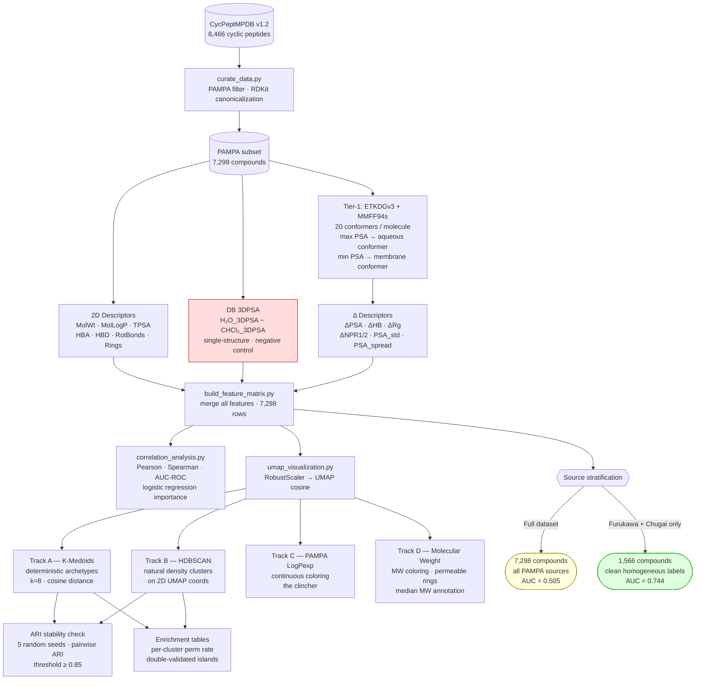

# Methodology Flowchart

```mermaid
flowchart TD
    A[("CycPeptMPDB v1.2\n8,466 cyclic peptides")]

    A --> B["curate_data.py\nPAMPA filter · RDKit canonicalization"]
    B --> C[("PAMPA subset\n7,298 compounds")]

    C --> D1["2D Descriptors\nMolWt · MolLogP · TPSA\nHBA · HBD · RotBonds · Rings"]
    C --> D2["DB 3DPSA\nH₂O_3DPSA − CHCl₃_3DPSA\nsingle-structure · negative control"]
    C --> D3["Tier-1: ETKDGv3 + MMFF94s\n20 conformers / molecule\nmax PSA → aqueous conformer\nmin PSA → membrane conformer"]

    D3 --> E["Δ Descriptors\nΔPSA · ΔHB · ΔRg\nΔNPR1/2 · PSA_std · PSA_spread"]

    D1 & D2 & E --> F["build_feature_matrix.py\nmerge all features · 7,298 rows"]

    F --> G["correlation_analysis.py\nPearson · Spearman · AUC-ROC\nlogistic regression importance"]

    F --> H["umap_visualization.py\nRobustScaler → UMAP cosine"]

    H --> I["Track A — K-Medoids\ndeterministic archetypes\nk=8 · cosine distance"]
    H --> J["Track B — HDBSCAN\nnatural density clusters\non 2D UMAP coords"]
    H --> K["Track C — PAMPA LogPexp\ncontinuous coloring\nthe clincher"]
    H --> L["Track D — Molecular Weight\nMW coloring · permeable rings\nmedian MW annotation"]

    I & J --> M["ARI stability check\n5 random seeds · pairwise ARI\nthreshold ≥ 0.85"]
    I & J --> N["Enrichment tables\nper-cluster perm rate\ndouble-validated islands"]

    F --> O{{"Source stratification"}}
    O -->|"Full dataset"| P(["7,298 compounds\nall PAMPA sources\nAUC = 0.505"])
    O -->|"Furukawa + Chugai only"| Q(["1,566 compounds\nclean homogeneous labels\nAUC = 0.744"])

    style D2 fill:#fdd,stroke:#c00
    style Q fill:#dfd,stroke:#090
    style P fill:#ffd,stroke:#880
```
